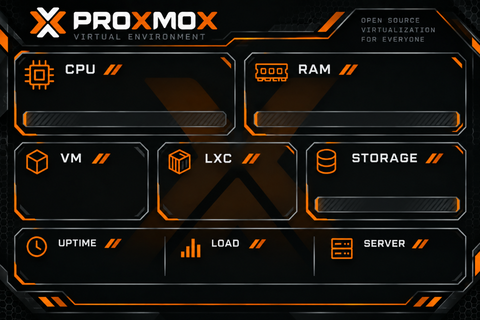

<div align="center">

# ProxmoxPVE · LCD Dashboard

**As informações essenciais do seu Proxmox, sempre à vista.**

Tema para Turing Smart Screen USB **3.5″ · 480 × 320 · Landscape**

[Instalação no PVE](INSTALACAO-PVE.md) · [Tema](res/themes/ProxmoxPVE/theme.yaml) · [Projeto original](https://github.com/mathoudebine/turing-smart-screen-python)



*Background original. Os valores são desenhados e atualizados pelo aplicativo durante a execução.*

</div>

## Seu servidor em uma tela

O **ProxmoxPVE** transforma um pequeno LCD USB em um painel para acompanhar o host sem abrir a interface web. O visual combina fundo escuro, detalhes em laranja e as informações que fazem diferença no dia a dia.

| Painel | Informação |
| :--- | :--- |
| **CPU** | Uso em percentual, temperatura e barra |
| **RAM** | Uso em percentual e barra |
| **STORAGE** | Uso do filesystem raiz `/`, em percentual e barra |
| **VM / LXC** | Quantidade em execução / total no nó local |
| **UPTIME / LOAD** | Tempo ligado e load average de 1 minuto |
| **SERVER** | Hostname e versão do Proxmox VE |
| **DATA / HORA** | `DD/MM/AAAA` e `HH:MM`, em 24 horas |

O armazenamento é genérico: não depende de nomes como `local`, `local-lvm` ou do modelo do disco. O indicador representa **o filesystem `/`**, não a soma dos storages nem a ocupação de todos os discos do host.

## Como funciona

**Instale o aplicativo original atualizado → copie as customizações → inicie o painel.**

Este repositório distribui o tema e a configuração para PVE. O aplicativo continua sendo obtido diretamente de [mathoudebine/turing-smart-screen-python](https://github.com/mathoudebine/turing-smart-screen-python).

1. Clone o upstream em `/opt/turing-smart-screen-python` e instale suas dependências em um ambiente virtual Python.
2. Clone este repositório em `/opt/turing-smart-screen-python-pve`.
3. Faça backup e sobreponha manualmente o tema, os sensores e a configuração.
4. Teste o LCD e habilite o serviço systemd para executar em segundo plano e iniciar no boot.

**[Abrir o passo a passo completo de instalação →](INSTALACAO-PVE.md)**

As atualizações são feitas manualmente. O guia explica como obter uma revisão nova do upstream e reaplicar o tema com possibilidade de rollback. A compatibilidade com futuras revisões deve ser validada antes de colocar o painel em serviço.

## Hardware e ambiente

- Host **Proxmox VE**, executando os comandos como **root**.
- LCD USB **3.5 polegadas**, revisão **A / USBMONITOR_3_5**.
- Orientação **landscape**, com background físico de **480 × 320 pixels**.
- Sensores Python para CPU, RAM e disco; `pvesh` para VM/LXC.

O painel não precisa de ambiente gráfico. Depois de configurar o serviço, você pode fechar a sessão SSH: o LCD permanece ativo e volta a carregar no próximo boot do host.

## O que há neste repositório

```text
.
├── README.md
├── INSTALACAO-PVE.md
├── config.yaml
├── library/
│   └── sensors/
│       └── sensors_custom.py
└── res/
    └── themes/
        └── ProxmoxPVE/
            ├── background.png
            └── theme.yaml
```

O arquivo `sensors_custom.py` contém a base de sensores customizados do upstream e o bloco Proxmox. A cópia manual substitui esse arquivo na instalação de destino; preserve sensores adicionais que você já tenha criado. O guia também descreve como transferir apenas o bloco Proxmox quando necessário.

## Coleta enxuta

VM e LXC compartilham o resultado de `/cluster/resources --type vm`, com cache de aproximadamente **20 segundos após uma consulta bem-sucedida**. Uptime vem de `/proc/uptime`, load vem de `os.getloadavg()` e hostname/versão são cacheados durante a execução.

Data e hora usam `datetime.strftime`, garantindo o formato independentemente do idioma do sistema. No tema atual, os campos customizados atualizam a cada **20 segundos**, incluindo o relógio. Em falhas da API, o coletor mantém o último resultado válido; consulte os logs e a API se as contagens parecerem desatualizadas.

## Personalização

O brilho fica em `display.BRIGHTNESS` no `config.yaml`, na faixa de **0 a 100**. O exemplo deste repositório usa **80**. Coordenadas, fontes e intervalos ficam em `res/themes/ProxmoxPVE/theme.yaml`.

Após qualquer alteração, reinicie:

```bash
systemctl restart turing-smart-screen.service
```

Mantenha o PNG em **480 × 320 pixels reais**: os campos usam `BACKGROUND_IMAGE` para restaurar o fundo a cada atualização e evitar resíduos de valores anteriores.

## Créditos

Tema e adaptação para Proxmox VE: **Bruno Barreto — São Barreto**.

Aplicativo e driver do LCD: [Matthieu Houdebine e colaboradores](https://github.com/mathoudebine/turing-smart-screen-python). Preserve os avisos de licença presentes no código original.

Projeto independente, sem afiliação oficial com Proxmox. As marcas e os logotipos pertencem aos respectivos titulares.